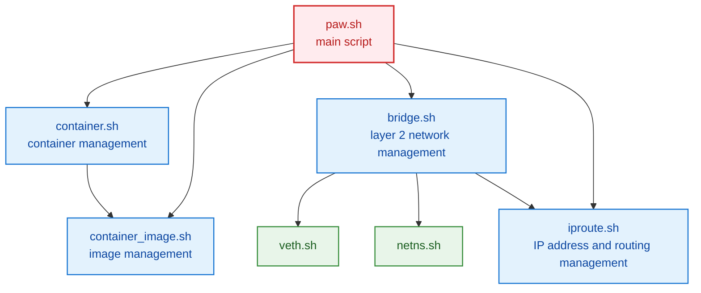

# nspawnコンテナのスクリプト

コンテナ操作のコマンドをラップしたスクリプト
- systemd-nspawn
- systemd-run
- machinectl

### コンテナ
- base rootfs作成
- コンテナ作成・実行・停止・削除
- コンテナのリスト・情報
- 複数のコンテナを組み合わせるスクリプトのサンプル

### ネットワーク
- ブリッジ、netns、veth
- ネットワーク情報表示、保存、復元

### スクリプト

