# lib

ディレクトリ構成
```
lib
- common.sh
- logger.sh
- query.sh
- setup_nspawn.sh
- state.sh
- container
    - container_image.sh
    - container.sh
- vnet
    - bridge.sh
    - iproute.sh
    - veth.sh
    - netfilter.sh
```

関数マップ
```
lib
- common.sh
    - load_logger
        -> lib/logger.sh
    - load_query
        -> lib/query.sh
    - check_root
- logger.sh
    - rotate_log
    - log
        -> rotate_log
- query.sh
    -> lib/logger.sh
    - get_bridge_info
    - list_bridges
    - get_bridge_ports
    - get_veth_info
    - get_netns_interfaces
- setup_nspawn.sh
    -> lib/common.sh
        -> load_logger
        -> check_root
    - install_packages
    - install_base
        -> install_packages
    - install_utils
        -> install_packages
    - install_yq

- container
    - container_image.sh
        -> lib/common.sh
            -> load_logger
            -> check_root
        - cleanup
    - container.sh
        - init
            -> lib/common.sh
                -> load_logger
                -> check_root
        - usage
        - container_start
        - container_stop
            -> is_running
        - container_shell
        - cleanup
        - container_status
        - container_list
        - container_exists
        - is_running

- vnet
    - bridge.sh
        -> lib/logger.sh
        -> lib/query.sh
        - create_bridge
            -> bridge_exists
        - delete_bridge
            -> bridge_exists
        - bridge_exists
        - bridge_up
        - bridge_down
    - netns.sh
        -> lib/common.sh
            -> load_logger
            -> check_root
        - create_netns
            -> netns_exists
        - netns_exists
            -> netns_exists
        - remove_netns
    - iproute.sh
        -> lib/logger.sh
        -> lib/query.sh
        - assign_ip_address
        - setup_routing
    - veth.sh
        -> lib/logger.sh
        -> lib/query.sh
        - init
            -> load_logger
            -> check_root
        - create_veth
        - delete_veth
        - attach_veth
        - detach_veth
        - list_veth
        - veth_info
        - main
            -> init
```

### state.sh

root限なし

```
image
image_exists
image_list
image_state
    name
    description
    created

container
container_is_running   # コンテナ実行中？
container_exists
container_list
container_state
    name
    description
    network
    status
    created
check_state
```

network
```
bridge_list   # bridgeのリスト
bridge_exists
list_bridge_ports
bridge_ports
    is_up
    is_down
    ip-address
    is_exists
```



```mermaid
graph TD
    PAW[paw.sh] --> CONTAINER
    PAW --> STATE
    
    CONTAINER --> |状態確認要求| STATE
    CONTAINER --> |状態更新要求| STATE
    CONTAINER --> |実際の操作| E
    
    STATE --> |JSON操作| F[state.json]
    STATE --> |実際の状態確認| E
    STATE --> |実際の状態確認| I
    
    subgraph "External Commands"
        E[machinectl]
        I[systemctl]
    end
    
    subgraph "Data Files"
        F[state.json]
    end
    
    subgraph "Core Scripts"
        CONTAINER["container.sh<br/>- container_start()<br/>- container_stop()"]
        STATE["state.sh<br/>- add/remove/update<br/>- check/get/list/exists"]
    end

    style CONTAINER fill:#443333
    style STATE fill:#334444  
```

## 案

nspawnコンテナ管理スクリプトの関数名を提案します。以下のようにカテゴリ別に関数名を整理しました：

## 基本操作関数
- `container_start()`
- `container_stop()`
- `container_restart()`
- `container_status()`
- `container_list()`
- `container_shell()`

## コンテナ作成/設定関連
- `container_create()`
- `container_remove()`
- `container_clone()`
- `container_configure()`
- `container_setup_network()`
- `container_mount()`
- `container_unmount()`
- `container_cleanup()`

## イメージ管理
- `image_create()`
- `image_import()`
- `image_export()`
- `image_remove()`
- `image_list()`

## ネットワーク関連
- `create_bridge()`
- `remove_bridge()`
- `setup_veth()`
- `setup_macvlan()`
- `setup_ipvlan()`
- `network_attach()`
- `network_detach()`

## 状態チェック関数
- `container_exists()`
- `container_is_running()`
- `container_is_stopped()`

## ユーティリティ関数
- `container_backup()`
- `container_restore()`
- `container_migrate()`

